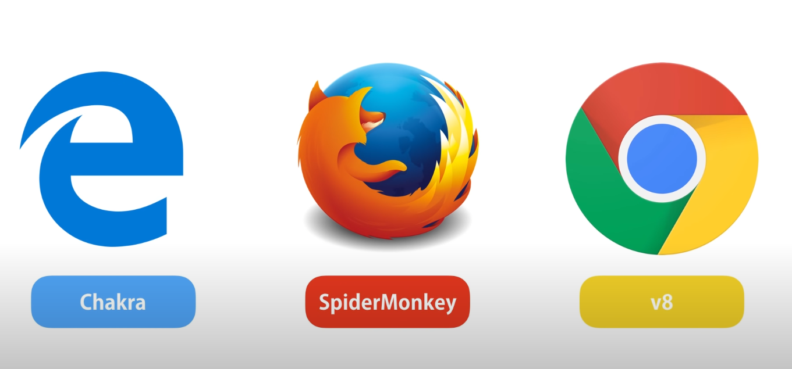

# Basics of NodeJS  

## What is Node JS

Node JS is ideal for building highly-scalable, data-intensive and real time apps, backend services or client applications.

### Advantages of Node JS

- Great for prototyping and agile development
- Superfast and highly scalable ( used by PapyPal, Uber, Netflix, Walmart etc.)
    
    *PayPal did a rollout from Java to NodeApp and build it twice as fast with fewer people, 33% fewer lines of code, 50% fewer files, 2x request/sec , 35% faster response time
    
- JavaScript everywhere  - very common language, also front-end developer can build full stack app.
- Cleaner and more consistent codebase - using JS on front and back, same name conventions, same tools, same best practices.
- Large ecosystem of open-source library's(almost for any feature you wanna to have)

## Node JS Architecture

### NodeJS - A runtime environment for executing JavaScript code.

### JS Engines in Web browsers



Browser provide run time environment for JavaScript code.

For example in browser we have ‘document’ and ‘window’ objects.

Up to 2009 a way of executing code were only in the browsers, In 2009  Ryan Dahl the creator of node came with a brilliant idea to execute JavaScript outside browser.

He took the fastest JS engine - V8(Chrome) and embedded it inside C++ program an called it Node. ( diff environment object that in browser)

Both Chrome and node share the same JavaScript engine but they provide different run time environment for JavaScript

*** Node is not a programing language its a runtime environment.

## How Node  Works

- It have a non-blocking asynchronous nature(architecture).
- Single Thread but can handle multi requests.
- Node applications are asynchronous by default.
- It uses Event Queue(monitoring it) to receive the async responses and than get back to them.
- Serving one client/request at a time , another have to wait.
- Node is ideal for I/)-intensive apps.
- Node should not be used for CPU-intensive apps.


## NodeJS - Create and Run

```jsx
//Check nodejs version
node -v
//v18.16.0

//Create a folder for the app
mkdir my-app

//Enter the folder 
cd my-app

//Open the folder in the code editor
code .

//Create a new app.js file
touch app.js

//Run App / Files
node app.js

//Trying to access window object that are not avalible not in the browser 
console.log(window);
// ReferenceError: widown is not defined
```

## NodeJS Global Object

- There are functions that are globally available like :
console.log() , setTimeout(), setInterval()  they all present on the global object in JS.
 `global`
- In node we have few additional global objects
- In browser we have `window` object that we can access all the global object

```jsx
//When we set a variable, its also present on a window object.
var message = '';
window.message
```

- In Node we don’t have window object we have global

```jsx
var message = '';
global.message
global.console.log('hello')
```

## NodeJS Modules

- In modern JavaScript application we split our code into many files.
- Its not a good practice to put/create variables and function on global scope because it can create overrides and distortions when we have a lot of code.
- We should capsulate code in to modules.
- every file in node Application considered a module, the vars and functions inside of it are considered a private, if we wanna use them we should explicitly export them(make them public) and import in the file/module we wanna use, otherwise they available only in the scope of origin file/module.
- App.js is a main module.

```jsx
console.log(module)

/*
Module {
  id: '.',
  path: 'C:\\Users\\xxx\\\OneDrive\\Desktop\\dev\\nodejs-basics',
  exports: {},
  filename: 'C:\\Users\\xxx\\OneDrive\\Desktop\\dev\\nodejs-basics\\app.js',
  loaded: false,
  children: [],
  paths: [
    'C:\\Users\\xxx\\OneDrive\\Desktop\\dev\\nodejs-basics\\node_modules',
    'C:\\Users\\xxx\\OneDrive\\Desktop\\dev\\node_modules',
    'C:\\Users\\xxx\\OneDrive\\Desktop\\node_modules',
    'C:\\Users\\xxx\\OneDrive\\node_modules',
    'C:\\Users\\xx\\node_modules',
    'C:\\Users\\node_modules',
    'C:\\node_modules'
  ]
}
*/
```

### Creating a Module

```jsx
//Logger Module

const url = 'https://mylogger.io/log';

function log(message) {
 //Sent an HTTP request
	console.log(message)
}

//Exporting
module.exports.log = log;
//module.exports.url = url;
```

### Loading a Module

```jsx
//app.js main module

cosnt logger = require('./logger');

console.log(logger);

//{log: [Funtion: log]}

logger.log('message');
// message
```

### Module Wrapping Function

- Each module is wrapper behind the scene with IIFE

```jsx
(function (exports, require, nodule,__filename, __dirname) {
/// ..file/module code
})
```

- You can also export by writing export … in the module

### Build in Modules of node current latest version

[https://nodejs.org/dist/latest-v21.x/docs/api/](https://nodejs.org/dist/latest-v21.x/docs/api/)

**Useful Modules:**

**Files System** - to work with files

**HTTP** - we can create web servers that listen for requests

**OS** - to work with operating system

**Path** - gives us a bunch of utility functions working with paths

**Process** - give us a information of the current process 

**Query Strings**  -  useful for building http services 

**Steam** - allows us work with streams of data 

## Path Module

```jsx
const path = require('path');
const pathObj = path.parse(__filename);

console.log({pathObj})

/* 
{
  pathObj: {
    root: 'N:\\',
    dir: 'N:\\Users\\xxx\\Desktop\\dev\\nodejs-basics\\common-modules',
    base: 'path.js',
    ext: '.js',
    name: 'path'
  }
*/

```

## OS Module

```jsx
const os = require('os');

let totalMemory = os.totalmem();
let freeMemory = os.freemem();

console.log('Free Memory: ' + freeMemory);
console.log('Total Memory: ' + totalMemory);

// Free Memory: 15333224448
// Total Memory: 34064277504
```

## File System Module

```jsx
const fs = require('fs');

const files = fs.readdirSync('./');
//Show array of string that current folder have

// Async func readdir
fs.readdir('./', function(err,files){
	if(err) console.log('Error', err);
 else  console.log('Result' , files);
});

// Result [ 'app.js', 'assets', 'common-modules', 'module-example', 'README.md' ]
```

## Events  Module

One of the core concepts in Node.

Event - a signal that indicates  something happend in the application.

In node we have class http  to build a web server that listen on a given port to request and every time there is a request we have an

 event : New Request , our job is to respond to this event that evolves reading this request doing some functionality and sending a response .

Events → EventEmitter

One of the core building block of Node and a lot of this classes based on this EventEmitter

```jsx
const EventEmitter = require('events');

const emitter = new EventEmitter();

// Registring a listener
emitter.on('messageLogged', function(){
  console.log('Listener Called');
});

// To raise an event , emit means to make a noise or produce something - signalling

// Triggering messageLogged Event
emitter.emit('messageLogged'); //name of the event

```

### Event Arguments

```jsx
const EventEmitter = require('events');
const emitter = new EventEmiiter();

emitter.on('messageLogged', function(arg){ //e, eventArg
  console.log('Listener Called' , arg);
});

emitter.emit('messageLogged', {id: 1, url: 'http://...'});  

// Output: Listener Called {id: 1, url: 'http://....'}
```

### Extending Event Emitter

```jsx
//Logger.js

const EventEmitter = require('events');

class Logger extends EventEmitter{
	log(message){
	// Send an HTTP Reuest
		console.log(message);
	
	// Raise an Event
	  this.emit('messageLogged', {id: 1, url: 'http://...'});  
	}
}

module.exports = Logger;
```

```jsx
// App.js

const Logger = require('./logger');
const logger = new Logger();

// Register a Listener
logger.on('messageLogged', (arg) => {  
  console.log('Listener Called' , arg);
});

logger.log('message');

```

## HTTP Module

```jsx
const http = require('http');

const server = http.createServer();

server.on('connection', (socker) => {
	console.log('New connection...');
}
server.listen(3000);

console.log('Listening on port 3000...');
```

```jsx
const http = require('http');

const server = http.createServer( (req,res) => {
	if( req.url === '/') {
			res.write('Hello world');
			res.end();
	}

	if( req.url === '/api/courses') {
				res.write(JSON.stringify([1,2,3,4]));
				res.end();
	}
});

server.listen(3000);

console.log('Listening on port 3000...');
```

## NPM

- npm is the package manager for [Node.js](http://nodejs.org/). It was created in 2009 as an [open source project](https://github.com/npm/npm) to help JavaScript developers easily share packaged modules of code.
- The npm Registry is a public collection of packages of open-source code for Node.js, [front-end web apps](http://www.ember-cli.com/), [mobile apps](http://cordova.apache.org/), [robots](https://tessel.io/), [routers](https://linerate.f5.com/), and countless other needs of the JavaScript community.
- npm is the command line client that allows developers to install and publish those packages
- 
    
    ### package.json
    
    Creating a package JSON file to use 3th side modules.
    
    ```jsx
    npm init
    ```
    
    [https://docs.npmjs.com/cli/v10/configuring-npm/package-json](https://docs.npmjs.com/cli/v10/configuring-npm/package-json)
    

### NodeMon

nodemon is a tool that helps develop Node.js based applications by automatically restarting the node application when file changes in the directory are detected.

```jsx
npm install -g nodemon 
```

[https://www.npmjs.com/package/nodemon](https://www.npmjs.com/package/nodemon)

### Lodash

A modern JavaScript utility library delivering modularity, performance & extras.

[https://lodash.com/](https://lodash.com/)

```jsx
npm i -g npm
npm i --save lodash
```

[https://github.com/lodash/lodash/tree/4.17.21-npm](https://github.com/lodash/lodash/tree/4.17.21-npm)

common practice to use underscore (_)

```jsx
const _ = require('lodash');
```

### Express (framework)

Fast, unopinionated, minimalist web framework for **[Node.js](http://nodejs.org/)**.

```jsx
const express = require('express')
const app = express()

app.get('/', function (req, res) {
  res.send('Hello World')
})

app.listen(3000)
```

[https://www.npmjs.com/package/express](https://www.npmjs.com/package/express)

Express App

```jsx
const express = require('express')

// express app
const app = express()

//  listen for requests
app.listen(3000)

// Handler for '/' root url
app.get('/', function (req, res) {
     // res.send('Express App')
     res.sendFile('./views/index.html', {root: __dirname})
})

// Handler for '/about' url
app.get('/about', function (req, res) {
      res.sendFile('./views/about.html', {root: __dirname})
 })
 
 // Handler for  ridercting from '/about-us' to '/about' url
app.get('/about-us', function (req, res) {
      res.redirect('/about');
 })
 
 //Middleware
 // 404 page
 app.use(function (req, res) {
      res.status(404).sendFile('./views/404.html', {root: __dirname})
 })
```

### Middleware

Code which runs (on the server) between getting a request and sending a response.


**Middleware Examples:**

- Logger middleware to log details of every request
- Authentication check middleware for protected routes
- Middleware to parse JSON data from requests
- Return 404 pages

**3rd Party Middleware's**

**1. Helmet — Increase HTTP Header Security**

Helmet helps you secure your Express apps by setting various HTTP headers.

**2. Cookie-parser — Parse Cookies**

Cookie-parser is a middleware that transfers cookies with client requests

**3. Passport — Access to Wide Range of Authentication Mechanisms**

Passport is a simple unproductive authentication middleware for Node.js.

**4. Morgan— Log HTTP Requests and Errors**

Morgan is an HTTP request logger middleware for N typically used for apps.

**5. CORS — Allow or Restrict Requested Resources on a Web Server**

CORS is a node.js package that provides a Connect/Express middleware for enabling CORS with a variety of options.

[https://medium.com/@alirezakargar/what-app-use-method-do-in-express-js-7ea533d55b4e](https://medium.com/@alirezakargar/what-app-use-method-do-in-express-js-7ea533d55b4e)